<p align="center">
  <picture>
    <source
      media="(prefers-color-scheme: dark)"
      srcset="./dark.svg"
    />
    <source
      media="(prefers-color-scheme: light)"
      srcset="./light.svg"
    />
    
  </picture>
</p>

<p align="center">
  <a href="#koshkenbek-dauren"><code>[ 01 ] HOME</code></a>&nbsp;
  <a href="#featured-projects"><code>[ 02 ] PROJECTS</code></a>&nbsp;
  <a href="#security-focus"><code>[ 03 ] SECURITY</code></a>&nbsp;
  <a href="#technology-stack"><code>[ 04 ] STACK</code></a>&nbsp;
  <a href="#connect"><code>[ 05 ] CONTACT</code></a>
</p>

# Koshkenbek Dauren

**Cybersecurity Engineer · SOC Analyst · Penetration Testing**

I'm a cybersecurity engineer based in Kazakhstan, working as an **L1 SOC Analyst**: I monitor security events, analyse SIEM alerts, correlate logs and escalate incidents that need a deeper look. Alongside security operations I practise **web and network penetration testing** and build **security tools** that automate the repetitive parts of the work, from reconnaissance to reporting.

My focus is where defence and offence meet: understanding how attacks look in the logs, and how weaknesses are found and fixed.

---

## Security Focus

<table>
  <tr>
    <td width="50%" valign="top">
      <b>SOC Operations</b><br/>
      <sub>Continuous monitoring of security events and first-line response.</sub>
    </td>
    <td width="50%" valign="top">
      <b>SIEM &amp; Log Analysis</b><br/>
      <sub>Searching and correlating events across network, endpoint and security-device logs.</sub>
    </td>
  </tr>
  <tr>
    <td valign="top">
      <b>Threat Detection</b><br/>
      <sub>Recognising suspicious activity patterns in alerts and telemetry.</sub>
    </td>
    <td valign="top">
      <b>Incident Triage</b><br/>
      <sub>Separating false positives from events that need investigation and escalation.</sub>
    </td>
  </tr>
  <tr>
    <td valign="top">
      <b>Network Security</b><br/>
      <sub>Firewall and network-device events, exposed services, traffic context.</sub>
    </td>
    <td valign="top">
      <b>Web Security</b><br/>
      <sub>Web application attack surface and common vulnerability classes.</sub>
    </td>
  </tr>
  <tr>
    <td valign="top">
      <b>Penetration Testing</b><br/>
      <sub>Structured testing of web applications and networks within an authorised scope.</sub>
    </td>
    <td valign="top">
      <b>Security Automation</b><br/>
      <sub>Tools and scripts that remove repetitive manual steps from security work.</sub>
    </td>
  </tr>
</table>

---

## SOC / Blue Team

My day-to-day L1 workflow, from the first alert to a documented escalation:

```text
[ ALERT ]                  SIEM rule or security-device event fires
    │
    ▼
[ TRIAGE ]                 severity, asset, context: real signal or noise?
    │
    ▼
[ EVENT CORRELATION ]      related events across sources and time
    │
    ▼
[ LOG ANALYSIS ]           firewall, DLP, endpoint and system logs
    │
    ▼
[ INITIAL INVESTIGATION ]  scope, affected hosts and users, indicators
    │
    ▼
[ CLASSIFICATION ]         false positive · benign · suspicious · confirmed
    │
    ▼
[ ESCALATION ]             hand-off of suspicious / confirmed incidents to the next tier
```

| Tool | How I use it |
| :-- | :-- |
| **Splunk** | SIEM searches, alert review, event correlation |
| **FortiGate** | Analysis of firewall and network security events |
| **FortiDLP** · **Trellix DLP** | Review of data-loss-prevention events |

---

## Penetration Testing

Offensive practice with **Kali Linux** and **Hack The Box**, following a structured methodology:

| Stage | Focus |
| :-- | :-- |
| **Reconnaissance** | Attack-surface mapping, service and technology discovery |
| **Web Application Security** | Input handling, authentication, session and access-control flaws |
| **Network Security** | Exposed services, misconfigurations, weak network boundaries |
| **Vulnerability Assessment** | Identifying and prioritising weaknesses |
| **Security Testing** | Hands-on verification of attack paths |
| **Finding Validation** | Confirming impact with evidence and ruling out false positives |
| **Remediation Guidance** | Concrete, actionable fixes for every finding |
| **Reporting** | Clear write-ups for technical and non-technical readers |

I'm also automating this workflow in **[PentestAI](https://github.com/daurencd01/PentestAI)** (see below).

> Testing is performed only against systems I own or am explicitly authorised to test.

---

## Security Engineering

I build tools around the work above: automating assessment steps, structuring findings and turning security concepts into something people can practise hands-on.

The principles I build by:

- **Detection ≠ confirmation.** A finding counts only once it has been verified with evidence.
- **Authorised scope first.** Active testing never starts without confirmed authorisation.
- **Explain, don't just flag.** Every finding comes with context and remediation guidance.

---

## Featured Projects

<table>
  <tr>
    <td width="50%" valign="top">
      <h3>🛡️ HackShield Play Nexus</h3>
      <p>Gamified cybersecurity learning platform: interactive security missions and a 2D stealth game that turn security concepts into hands-on practice.</p>
      <p><b>Under the hood:</b> 2D stealth mechanics · A* pathfinding · guard AI built on a finite-state machine</p>
      <p><sub>React · TypeScript · Tailwind · shadcn/ui · Framer Motion · React Router · TanStack Query · Supabase · PostgreSQL</sub></p>
      <p>
        <a href="https://hackshield-play-nexus.vercel.app/">Live demo</a> ·
        <a href="https://github.com/daurencd01/hackshield-play-nexus">Repository</a>
      </p>
    </td>
    <td width="50%" valign="top">
      <h3>🔎 PentestAI</h3>
      <p><b>Automated Security Assessment.</b> A platform for automating web application penetration-testing workflows: reconnaissance, vulnerability discovery, finding verification, remediation guidance and report generation.</p>
      <p><code>URL → PENTEST → FIND → VERIFY → EXPLAIN → FIX → RETEST → REPORT</code></p>
      <p>Designed to support the tester, not to replace one: nothing is reported as a vulnerability until it has been verified.</p>
      <p><sub>Python · Status: architecture &amp; design stage</sub></p>
      <p>
        <a href="https://github.com/daurencd01/PentestAI">Repository</a>
      </p>
    </td>
  </tr>
  <tr>
    <td colspan="2" valign="top">
      <h3>🏐 OYNA</h3>
      <p>Platform for finding and joining amateur volleyball games in Astana: skill-matched game discovery, verified organizers, map-based location search, a fair rating system and RU / KZ / EN localisation.</p>
      <p><sub>React · TypeScript · Vite · shadcn/ui · Tailwind · Supabase · PostgreSQL · TanStack Query · i18next · Capacitor (Android)</sub></p>
      <p><sub>Private repository</sub></p>
    </td>
  </tr>
</table>

---

## Technology Stack

<p>
  
  
  
  
  
  
  
  
</p>

| Category | Technologies |
| :-- | :-- |
| **Security** | Web Security · Network Security · Reconnaissance · Vulnerability Assessment |
| **SOC / SIEM** | Splunk · SIEM · Log Analysis · Incident Triage · Threat Detection · Security Monitoring |
| **Security platforms** | FortiGate · FortiDLP · Trellix DLP |
| **Programming** | Python · TypeScript · JavaScript |
| **Frontend** | React · Next.js · Tailwind CSS · Framer Motion |
| **Backend & Database** | Supabase · PostgreSQL |
| **Infrastructure** | Docker · Vercel |
| **Tools** | Kali Linux · Hack The Box · Git |

---

## GitHub Activity

<p align="center">
  <picture>
    <source
      media="(prefers-color-scheme: dark)"
      srcset="https://streak-stats.demolab.com?user=daurencd01&background=0B1220&border=1E293B&stroke=1E293B&ring=22D3EE&fire=22D3EE&currStreakNum=F8FAFC&sideNums=F8FAFC&currStreakLabel=22D3EE&sideLabels=94A3B8&dates=64748B"
    />
    <source
      media="(prefers-color-scheme: light)"
      srcset="https://streak-stats.demolab.com?user=daurencd01&background=FFFFFF&border=E2E8F0&stroke=E2E8F0&ring=2563EB&fire=0891B2&currStreakNum=0F172A&sideNums=0F172A&currStreakLabel=2563EB&sideLabels=475569&dates=64748B"
    />
    
  </picture>
</p>

---

## Contribution Snake

<p align="center">
  <picture>
    <source
      media="(prefers-color-scheme: dark)"
      srcset="https://raw.githubusercontent.com/daurencd01/github-snake/output/github-snake-dark.svg"
    />
    <source
      media="(prefers-color-scheme: light)"
      srcset="https://raw.githubusercontent.com/daurencd01/github-snake/output/github-snake.svg"
    />
    
  </picture>
</p>

---

## Connect

<p>
  <a href="https://daurencd.xyz/"></a>
  <a href="https://github.com/daurencd01"></a>
</p>

<sub><code>SECOPS + PENTEST + ENGINEERING + AUTOMATION</code></sub>
